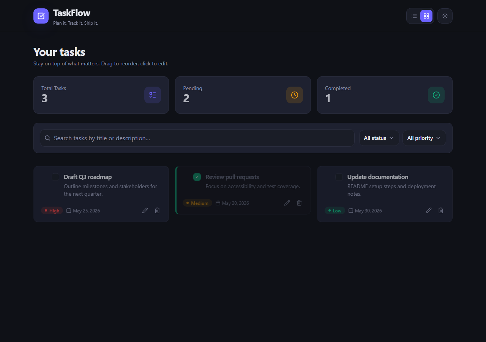
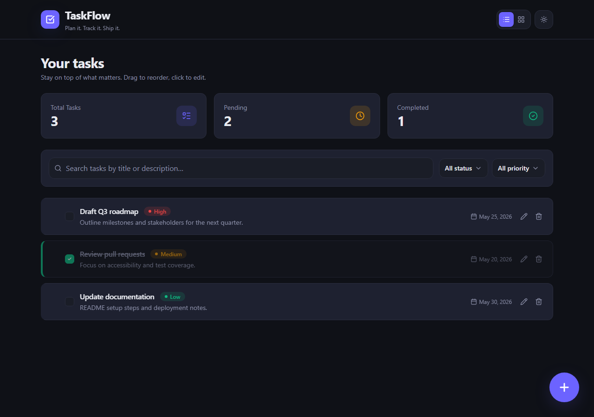
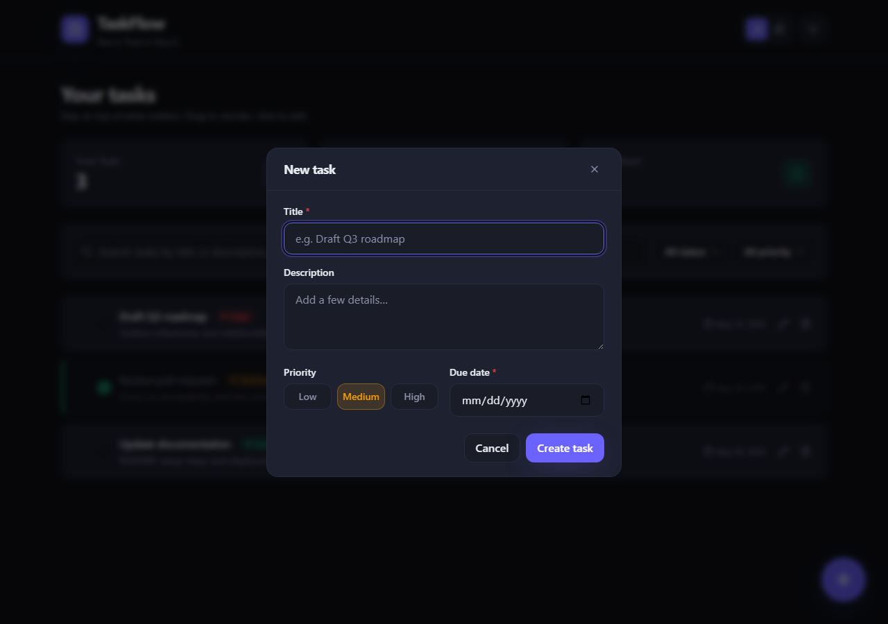
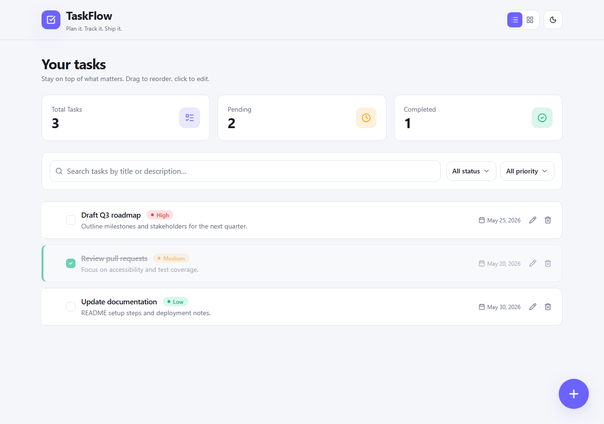

# TaskFlow — Task Management Dashboard

A responsive React task dashboard for creating, editing, filtering, and tracking tasks with persistent storage, list/card views, dark/light mode, and drag-and-drop reordering.

**Live demo:** `https://YOUR-APP.vercel.app` ← replace after you deploy

**Repository:** `https://github.com/YOUR_USERNAME/task-dashboard` ← replace with your repo

---

## Features

| Requirement | Implementation |
|-------------|----------------|
| Task creation | Modal with title, description, priority (Low/Medium/High), due date |
| Task display | List view + card view toggle |
| Edit tasks | Modal-based editing |
| Delete tasks | Confirmation dialog before delete |
| Status management | Checkbox toggle; strikethrough, opacity, and color for completed tasks |
| Search & filter | Search by title/description; filter by status and priority |
| Task counts | Total, pending, and completed stats |
| Data persistence | `localStorage` (survives page refresh) |
| Responsive design | Mobile, tablet, and desktop layouts |

### Bonus

- Card / list view toggle (persisted)
- Dark / light theme (persisted)
- Drag-and-drop reorder (`@dnd-kit`)
- Animations (`framer-motion`)
- TypeScript throughout
- Unit tests (Jest + React Testing Library)

---

## Screenshots

### Dashboard (dark mode, card view)



### Dashboard (list view)



### Create / edit task modal



### Light mode



> Replace images in `docs/screenshots/` if you retake screenshots after UI changes.

---

## Tech stack

- **React 19** + **TypeScript**
- **Vite** — dev server and production build
- **Tailwind CSS** — styling and responsive layout
- **@dnd-kit** — accessible drag-and-drop
- **Framer Motion** — transitions and micro-interactions
- **Jest** + **Testing Library** — unit tests

---

## Getting started

### Prerequisites

- [Node.js](https://nodejs.org/) 18+ (20+ recommended)
- npm 9+

### Install and run locally

```bash
git clone https://github.com/YOUR_USERNAME/task-dashboard.git
cd task-dashboard
npm install
npm run dev
```

Open **http://localhost:5173/** in your browser.

> Use the dev server URL. Do not open `index.html` directly from the file explorer.

### Other commands

```bash
npm run build    # Production build → dist/
npm run preview  # Preview production build locally
npm test         # Run unit tests
npm run lint     # ESLint
```

---

## Deployment

This app is a static Vite build. Recommended hosts: **Vercel** or **Netlify**.

### Vercel (recommended)

1. Push this repo to a **public** GitHub repository.
2. Go to [vercel.com](https://vercel.com) → **Add New Project** → import your repo.
3. Use defaults:
   - **Framework preset:** Vite
   - **Build command:** `npm run build`
   - **Output directory:** `dist`
4. Deploy, then copy the URL (e.g. `https://task-dashboard-xyz.vercel.app`).
5. Paste that URL at the top of this README under **Live demo**.

### Netlify

1. Import the GitHub repo at [netlify.com](https://www.netlify.com).
2. Build command: `npm run build` · Publish directory: `dist`
3. Add the live URL to this README.

### GitHub Pages

Requires setting `base` in `vite.config.ts` to your repo name. Vercel/Netlify are simpler for this project.

---

## Design decisions

1. **Modal over inline edit** — Keeps the list/card layout stable on mobile and groups validation (required title and due date) in one place.
2. **localStorage** — Meets persistence requirements without a backend; includes cross-tab sync via the `storage` event.
3. **Debounced search (300ms)** — Reduces re-filtering while typing.
4. **Visual status cues** — Completed tasks use checkbox state, strikethrough, reduced opacity, and a green left border instead of a separate text badge to reduce clutter.
5. **CSS variables + Tailwind** — Theme tokens in `index.css` enable dark/light mode with one `.light` class on `<html>`.
6. **Custom hooks** — `useTasks`, `useLocalStorage`, and `useTheme` separate data/UI concerns from presentational components.
7. **Drag-and-drop on filtered lists** — Reorder applies to visible tasks; hidden tasks keep relative order (acceptable trade-off for a client-only app).

---

## Project structure

```
src/
├── components/     # UI (TaskCard, TaskList, FilterBar, modals, …)
├── hooks/          # useTasks, useLocalStorage, useTheme, useDebounce
├── utils/          # filter/sort helpers
├── types.ts        # Shared TypeScript types
├── App.tsx         # Layout and wiring
└── main.tsx        # Entry point
```

---

## Testing

```bash
npm test
```

Covers task filtering/sorting, `useTasks` hook (CRUD + persistence), and `TaskCard` interactions.

---

## Submission checklist

- [ ] Code pushed to a **public** GitHub repository
- [ ] README updated with your **GitHub repo link** and **live demo URL**
- [ ] Screenshots added under `docs/screenshots/` (or confirm existing ones)
- [ ] App deployed (Vercel / Netlify / GitHub Pages)
- [ ] Repository link shared with the TA team within **48 hours**

---

## Author

[Your Name] — [Your email or student ID if required]
